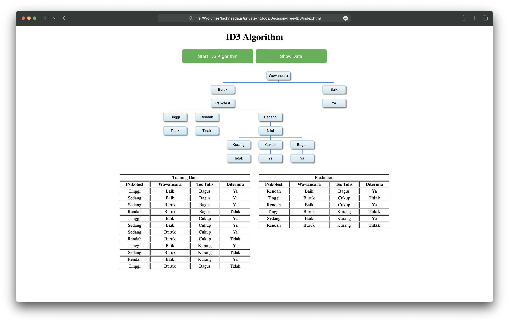

# Decision Tree ID3

### About This Repository

Repository for Decision-Tree for ID3 Algorithm with 3 Attributes and 18 Combination.

### Test Results

### About the Algorithm

The ID3 (Iterative Dichotomiser 3) algorithm is a popular decision tree algorithm used in machine learning. It aims to build a decision tree by iteratively selecting the best attribute to split the data based on information gain. Each node represents a test on an attribute, and each branch represents a possible outcome of the test.

[References](https://www.geeksforgeeks.org/sklearn-iterative-dichotomiser-3-id3-algorithms/)
